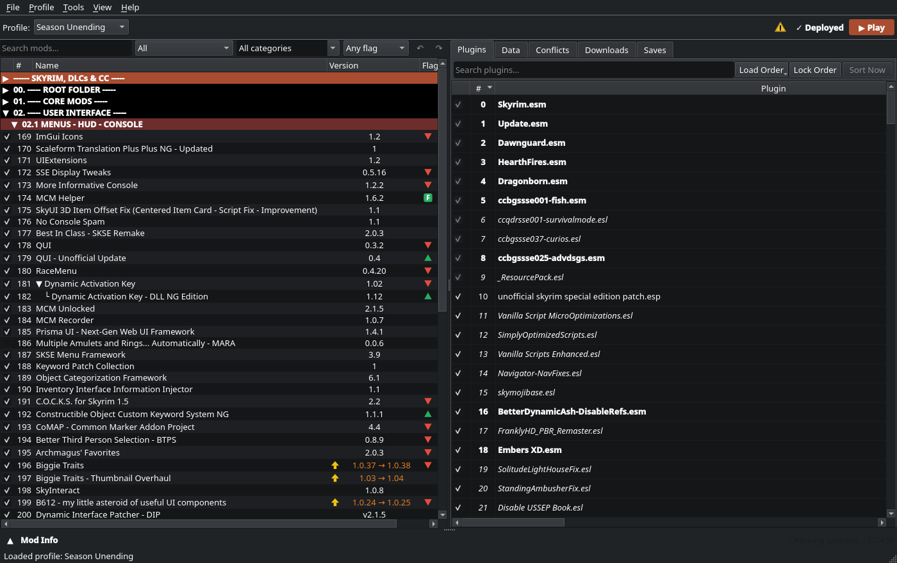
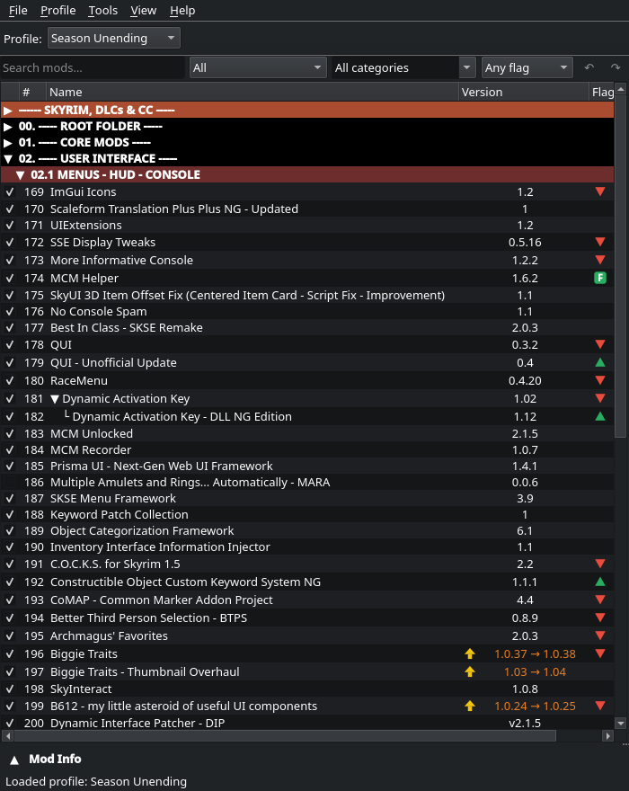
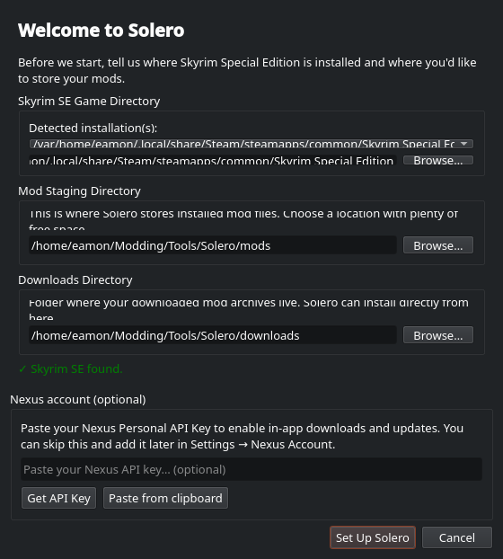
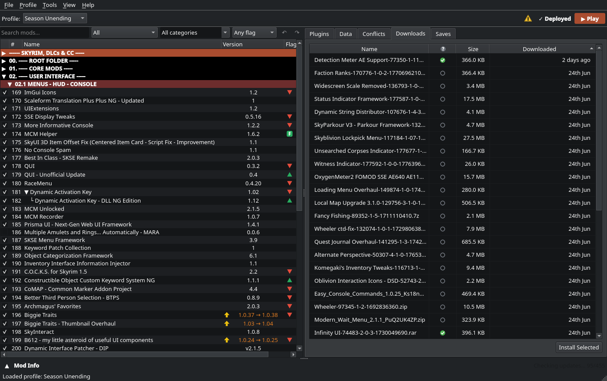
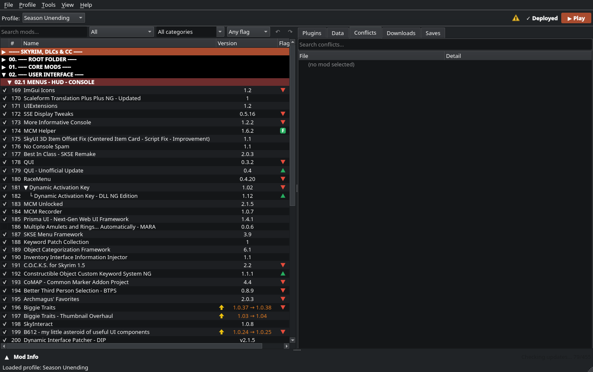
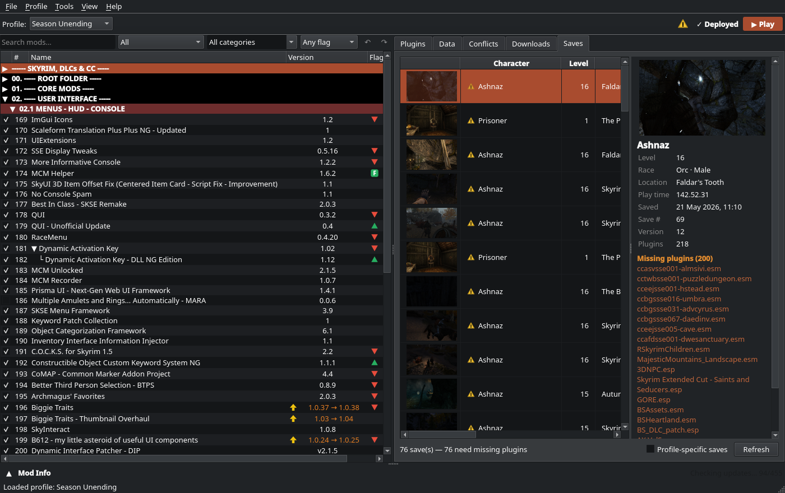
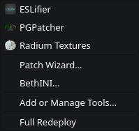
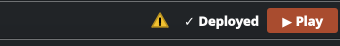
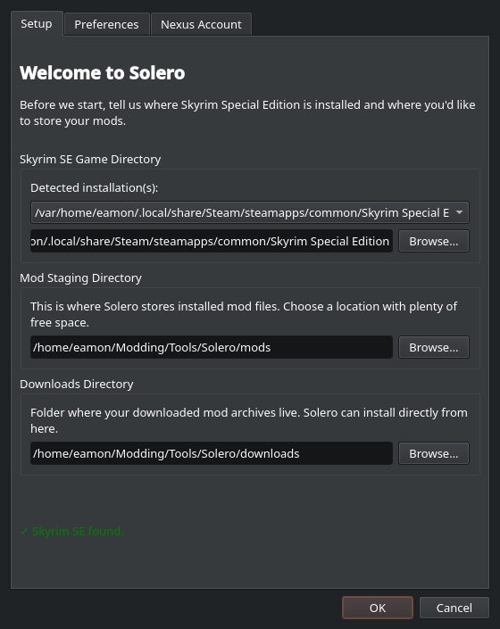

# Solero

A native mod manager for Skyrim Special Edition and Anniversary Edition on Linux.

Solero is an [MO2](https://github.com/ModOrganizer2/modorganizer)-style mod manager for
Linux and handheld PCs like the Steam Deck. You get the two-pane workflow Skyrim modders
are used to (an ordered mod list on the left, plugins and file data on the right), with
Proton support, hardlink deployment, the Nexus API, FOMOD installers, and LOOT sorting.

The short version of what makes it different: it uses Mod Organizer's structure and UI,
but deploys mods the way Vortex does. Your enabled mods are hardlinked straight into the
real game folder, so you launch Skyrim the ordinary way through Steam. There's no
non-Steam shortcut to create and no virtual filesystem to configure. That matters most
on the Steam Deck, where you can start your modded game from Game Mode or Big Picture
like any other title.

New here? The [full feature guide](docs/GUIDE.md) walks through everything below in more
detail.



## Why Solero

Mod Organizer 2 is the standard on Windows, but on Linux you run the whole thing under
Wine, and its virtual filesystem means the modded `Data` folder only exists while the
game runs through MO2's proxy. In practice that leaves you making a non-Steam shortcut
just to launch your list.

Solero keeps MO2's mod-list structure and UI but drops the VFS. It's a native Qt6 app
that hardlinks your enabled mods, in order, into the game's real `Data` folder. The game
and any external tool then see a normal, complete `Data` folder, and you launch Skyrim
through Steam as usual. On the Deck your modded game just works from Game Mode. Undeploy
removes the links and puts things back to vanilla.

What it does:

- Two-pane, MO2-style workflow. An ordered mod list with drag-to-reorder, categories
  (separators), and mod groups, with plugins and conflicts on the right.
- Hardlink deployment. Mods are staged separately, then hardlinked into the game on
  Deploy and cleanly undeployed after. Your game `Data` stays untouched.
- Profiles. Several independent load orders, each with its own plugins, INI settings,
  and tool configuration.
- Nexus integration. Browse Nexus Mods in the app, register as the `nxm://` handler for
  one-click downloads, and endorse or update mods. Premium is recommended if you want
  direct API downloads.
- FOMOD installer. Full scripted-installer support that remembers your choices, so a
  reinstall starts where you left off.
- LOOT sorting. Sort the plugin load order with libloot, including custom group rules.
- Conflict detection. See which mods win or lose each file, right in the list.
- External tools. Register and launch tools (xEdit, Nemesis or Pandora, DynDOLOD,
  BodySlide, PGPatcher, and so on) through Proton, and capture their output automatically.
- Importers. Bring in an existing MO2 setup, or install a Wabbajack modlist.
- Community Shaders support. A managed per-version shader cache, so switching CS versions
  doesn't recompile from scratch or deploy the wrong cache.
- Automation. A built-in MCP server lets MCP clients (AI assistants included) read and
  edit your load order, with a transaction log you can roll back.

## A quick tour

The window is two panes and a toolbar.

The left pane is the mod list. Your mods sit in priority order, with the bottom winning.
Enable one with its checkbox, sort mods under coloured separators, and group related mods
together. A filter box and state filters (conflicts, updates, missing dependencies) sit
above the list.

The right pane holds the details: tabs for the selected mod's files, the global plugin
load order, conflicts, downloads, and saves.

The toolbar has Deploy and Play. The status pill tells you whether your staged mods are
currently deployed, and Play launches the game through Steam and Proton.




## Getting started

### Install (Flatpak)

Download `solero.flatpak` from the [latest release](https://github.com/bizzanteen/Solero/releases)
and install it:

```bash
# one-time, if you don't already have Flathub set up
flatpak remote-add --if-not-exists --user flathub https://flathub.org/repo/flathub.flatpakrepo

flatpak install --user ./solero.flatpak
flatpak run io.github.bizzanteen.Solero
```

The first install pulls in the KDE runtime and the QtWebEngine base from Flathub. Solero
launches host programs (Steam, Proton, the game, and modding tools) through
`flatpak-spawn`, so the package asks for host filesystem access and the
`org.freedesktop.Flatpak` permission, which is normal for a tool like this.

### Build from source

Requirements: Qt 6 (Widgets, Svg, Network, WebEngine), a C++23 toolchain, CMake 3.25 or
newer, and the Rust toolchain (cargo, for libloot). Skyrim SE/AE has to be installed
through Steam (Proton). A Nexus Mods account is optional; Premium enables in-app API
downloads.

```bash
git clone https://github.com/bizzanteen/Solero.git solero
cd solero
cmake -B build
cmake --build build -j$(nproc)
```

Then run it with the helper script, which sets up the environment and opens the window
maximized:

```bash
./run-solero.sh
```

Run the tests with:

```bash
ctest --test-dir build
```

### First run

The first time you launch, a short setup wizard asks where Skyrim is installed, where to
stage your mods, where your downloads live, and (optionally) for your Nexus API key.



## Core concepts

Five ideas cover most of how Solero works.

| Concept | What it is |
|---|---|
| Staging | Where each mod's files actually live, one folder per mod, kept apart from the game. |
| Deploy | Hardlinking the enabled mods, in order, into the game's `Data` folder. Undeploy removes them again and leaves vanilla. |
| Profile | A named load order plus plugin selection plus INI and tool config. Switch freely; each one is independent. |
| Separator and Group | Organisational rows. Separators are coloured category headers; groups nest related mods under a parent. |
| Overwrite and Output mod | A capture folder for files tools generate at runtime, such as xEdit output or generated LOD. You can turn captured files into a real mod. |

One thing worth remembering: mods lower in the left pane overwrite mods above them, the
same priority model as MO2. Plugins (`.esp`, `.esl`, `.esm`) have their own separate
order in the Plugins tab.

<!-- TODO screenshot: a separator's right-click menu (Edit Separator, Indent/Outdent, Add Separator, Delete). Needs a live context-menu capture. -->

## Installing mods

There are a few ways to get mods in.

1. The Downloads tab. Archives already in your downloads folder show up here. Pick one
   and click Install Selected to run it through the installer.
2. Browse Nexus (`File > Browse Nexus`). Search and download from Nexus Mods without
   leaving the app.
3. The `nxm://` handler. Register Solero as your system's Nexus download handler, and the
   site's Mod Manager Download button sends files straight to it.
4. Import. Bring in a whole MO2 instance, or install a Wabbajack modlist.

When a mod ships a FOMOD scripted installer, Solero shows the option wizard. It remembers
your selections, so a later Reinstall (FOMOD) starts from the choices you made before.

<!-- TODO screenshot: the FOMOD installer wizard mid-install (radio/checkbox options + preview pane). Needs a real FOMOD archive part-way through an install. -->



### Versions and updates

Install a newer version of a mod and Solero asks whether to Replace, Keep Both, or
Rename. Keep Both turns the version cell into a dropdown, so you can flip between the
installed versions. Mods with a known Nexus ID show an update flag when a newer file is
out, and Update Mod fetches it.

## Load order, plugins, and conflicts

The Plugins tab is your master and plugin load order. Toggle plugins, drag to reorder,
and check the flags for masters, ESL, and missing masters. Sort with LOOT to let libloot
work out a sensible order, with custom group rules if you use them.

For conflicts, the Flags column in the mod list marks which mods win or lose file
conflicts. Select a single mod and Solero highlights what it overwrites in green and what
overwrites it in red, the same way MO2 does.



## Saves

The Saves tab lists your Skyrim savegames with an MO2-style previewer. Select a save to
see its screenshot and details: character, level, race, location, play time, and save
number. If a save references plugins your current load order is missing, it flags them.
The tab is read-only. Solero never moves or deletes a save.



## Tools

Register external tools under `Tools > Add or Manage Tools`. Solero launches them through
the game's Proton prefix, and it can capture their output into a dedicated output mod, so
generated files (LOD, patches, meshes) end up as a normal, orderable mod instead of loose
clutter in `Data`.



The Patch Wizard (in the Tools menu) scans your installed FOMOD mods for optional
compatibility patches that have become applicable to your current load order but were
never installed, then installs the ones you tick. The [full guide](docs/GUIDE.md#patch-wizard)
covers it in more detail.

## Deploying and playing

1. Enable the mods and set the order you want.
2. Click Deploy (`Ctrl+D`). The status pill goes from Not Deployed to Deployed, and if
   your staged mods change afterwards it shows Redeploy.
3. Click Play (`Ctrl+P`) to launch through Steam and Proton. The button greys out while
   the game is running and comes back when it closes.



Since deployment is real hardlinks rather than a VFS, you don't have to launch through
Solero at all. Once you've deployed, starting Skyrim Special Edition straight from Steam
(including Deck Game Mode and Big Picture) loads your modded setup too. Solero's Play
button just saves you the step of launching the SKSE loader.

## SKSE

Solero handles the Skyrim Script Extender for you.

`Settings > SKSE > Change version` fetches the available SKSE builds from Nexus and
installs the one you pick (this needs a Nexus API key). The installed version is shown
right there. When you hit Play, Solero launches `skse64_loader.exe` so your
script-extender mods load, and if SKSE isn't installed yet it offers to fetch it rather
than starting a broken session.

The [full guide](docs/GUIDE.md#skse) has the details.

## Community Shaders

[Community Shaders](https://www.nexusmods.com/skyrimspecialedition/mods/86492) compiles a
shader cache that's slow to rebuild, so Solero manages it for you.

It keeps a separate compiled cache per CS version, which means switching versions
restores that version's cache instead of recompiling, and never deploys the wrong one.
It captures the cache after you play, and re-links it into the game before each launch,
because Community Shaders deletes `Data/ShaderCache` at runtime. That's what stops you
recompiling shaders every session. If you do want a clean recompile, right-click the
Community Shaders mod and choose Clear Shader Cache.

The [full guide](docs/GUIDE.md#community-shaders) has the details.

## Keyboard shortcuts

Press F1 at any time for the in-app list (`Help > Keyboard Shortcuts`).

| Action | Shortcut |
|---|---|
| Deploy | `Ctrl+D` |
| Play | `Ctrl+P` |
| Install mod(s) | `Ctrl+I` |
| Filter / search mods | `Ctrl+F` |
| Settings | `Ctrl+,` |
| Undo mod move | `Ctrl+Z` |
| Redo mod move | `Ctrl+Shift+Z` |
| Delete selected mods | `Del` |
| Toggle enabled | `Space` |
| Check mods for updates | `F5` |
| Zoom in / out / reset | `Ctrl++` / `Ctrl+-` / `Ctrl+0` |
| Keyboard shortcuts help | `F1` |
| Quit | `Ctrl+Q` |

To resize a column, grab the divider on its right edge (Name included) and drag. The
columns always fill the pane. Right-click a column header to show or hide columns.

## Settings

`Settings` (`Ctrl+,`) covers your game, staging, and downloads paths, your Nexus API key,
the SKSE version, separator-colour behaviour, deletion confirmations, and more. The Zoom
controls (or `Ctrl` with `+` and `-`) scale the whole UI, which is handy on a handheld
screen.



## Troubleshooting

If the game won't launch or hangs, check the Steam AppID and Proton prefix in Settings,
and make sure Deploy shows Deployed.

If a tool errors immediately, check that it's set to run under Proton and that its path
points at the real executable.

If something looks wrong after an update, try Undeploy then Deploy to re-assert a clean
set of hardlinks.

### Logs

Solero writes a log to `~/.local/share/solero/logs/solero.log`, rotated at about 5 MB
with a few generations kept. It records deploys, installs, downloads, Nexus calls,
profile changes, tool launches, and any crash backtrace, so it's the thing to attach when
you report a bug. Your Nexus API key is never written to it.

For deeper tracing on one subsystem, launch with a logging rule:

```bash
QT_LOGGING_RULES="solero.deploy.debug=true" ./run-solero.sh
```

The categories are `solero.app`, `solero.deploy`, `solero.loot`, `solero.install`,
`solero.fomod`, `solero.nexus`, `solero.download`, `solero.profile`, `solero.tools`, and
`solero.shader`. The verbose `.debug` output is off by default, so normal logging costs
nothing measurable.

## Project layout

```
src/
  ui/        Qt widgets: main window, panes, dialogs, wizards
  core/      profiles, mod list, plugin list, config, staging
  deploy/    hardlink deploy/undeploy, conflict index
  install/   archive extraction and mod installation
  fomod/     FOMOD scripted-installer engine
  nexus/     Nexus Mods API client
  loot/      libloot load-order sorting
  tools/     external-tool launching (Proton)
  import/    MO2 and Wabbajack importers
  patch/     patch/FOMOD scanning
  ...
tests/       unit and integration tests (ctest)
```

## Contributing

Contributions are welcome. A few things to keep in mind:

- Keep the build warning-clean (`cmake --build build -j$(nproc)`).
- Keep the tests passing (`ctest --test-dir build`).
- Match the surrounding code style.
- For non-ASCII text, don't write a multi-byte UTF-8 glyph as `\xNN` byte escapes inside
  a `QStringLiteral` or `u"..."`. Those are treated as UTF-16 units and render as
  mojibake. Use `QChar('-')`, `QString::fromUtf8(...)`, or an actual UTF-8 character in
  the source. The `check_no_mojibake` test enforces this.

## License

Solero is licensed under the GNU General Public License v3.0. See [LICENSE](LICENSE).

## Acknowledgements

Solero started as a fork of [Limo](https://github.com/limo-app/limo), a general-purpose Qt
mod manager for Linux by Chris (limo-app), and grew from there into a Skyrim-focused,
MO2-style manager. Huge thanks to Chris; Limo is the foundation this is built on.

Wabbajack modlist installation is powered by
[Jackify](https://github.com/Omni-guides/Jackify) and its `jackify-engine`, by
Omni-Guides. Thank you for making Wabbajack on Linux possible.

It also takes inspiration from [Mod Organizer 2](https://github.com/ModOrganizer2/modorganizer)
and the wider Skyrim modding community, and load-order sorting is powered by
[libloot](https://github.com/loot/libloot).
