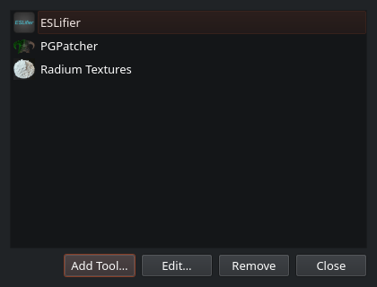
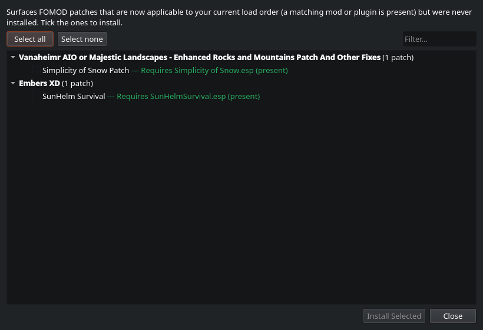
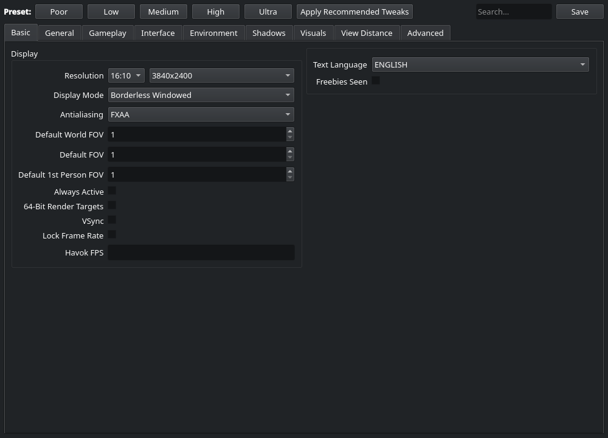
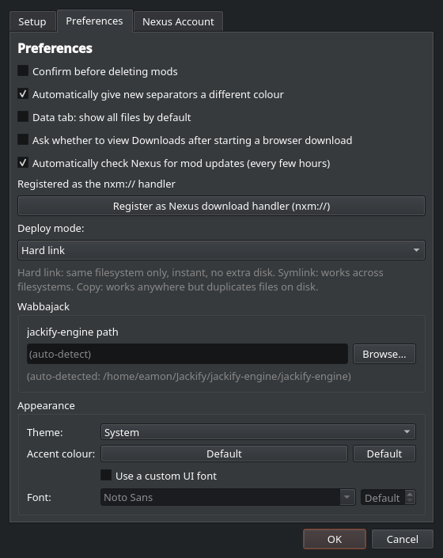
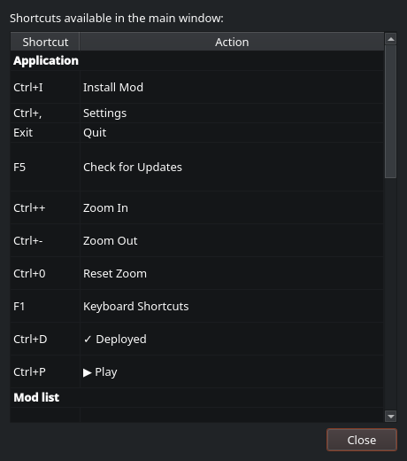

# Solero Full Feature Guide

A complete tour of Solero, the native Linux mod manager for Skyrim Special Edition and
Anniversary Edition. If you just want the quick version, the [README](../README.md) has
it. This document goes into every feature in detail.


## Contents

- [How Solero works (and why)](#how-solero-works-and-why)
- [Installation & first run](#installation--first-run)
- [Core concepts](#core-concepts)
- [The main window](#the-main-window)
- [The mod list](#the-mod-list)
- [Installing mods](#installing-mods)
- [Versions & updates](#versions--updates)
- [Plugins & load order](#plugins--load-order)
- [Conflicts & the Overwrite](#conflicts--the-overwrite)
- [Deploying & playing](#deploying--playing)
- [SKSE](#skse)
- [Community Shaders](#community-shaders)
- [Tools](#tools) and [Patch Wizard](#patch-wizard)
- [INI files (BethINI)](#ini-files-bethini)
- [Saves](#saves)
- [Profiles](#profiles)
- [Health checks & problems](#health-checks--problems)
- [Appearance & settings](#appearance--settings)
- [Keyboard shortcuts](#keyboard-shortcuts)
- [Automation & AI assistants (MCP)](#automation--ai-assistants-mcp)
- [Reporting bugs & logs](#reporting-bugs--logs)
- [Troubleshooting](#troubleshooting)

## How Solero works (and why)

Solero borrows the structure and UI of Mod Organizer 2 (an ordered, priority-based mod
list with categories, groups, per-file conflict control, and a separate plugin load
order) but swaps MO2's virtual filesystem for Vortex-style real deployment.

Here's the difference in practice. MO2 keeps your mods in separate folders and only makes
them visible to the game through a VFS while the game runs under MO2's proxy. On Linux
that means running MO2 itself under Wine and adding a non-Steam shortcut to launch your
list. Solero stages your mods separately too, but on Deploy it hardlinks the enabled mods,
in priority order, directly into the game's real `Data` folder. After that, the game,
Steam, and every external tool see a normal, complete `Data` folder.

Because the files are physically there, you launch Skyrim Special Edition the normal way
through Steam, Steam Deck Game Mode and Big Picture included, and your mods load. There's
no proxy, no non-Steam shortcut, and no `usvfs`. Undeploy removes the hardlinks and
restores vanilla.

Hardlinks cost no extra disk, since the staged file and the deployed file are the same
inode, as long as staging and the game live on the same filesystem. If they're on
different filesystems, use Symlink or Copy mode (see [Deploying](#deploying--playing)).

## Installation & first run

### Flatpak (recommended)

Grab `solero.flatpak` from the [latest release](https://github.com/bizzanteen/Solero/releases)
and install it:

```bash
flatpak install --user ./solero.flatpak
flatpak run io.github.bizzanteen.Solero
```

The first install also pulls the KDE runtime and the QtWebEngine base it needs from
Flathub, so make sure Flathub is set up:

```bash
flatpak remote-add --if-not-exists --user flathub https://flathub.org/repo/flathub.flatpakrepo
```

A note on the sandbox: Solero's whole job is launching other programs (Steam, Proton, the
game, and modding tools), which live on the host rather than inside the Flatpak. It runs
them through `flatpak-spawn`, which is why the package asks for host filesystem access and
the `org.freedesktop.Flatpak` permission. That is expected for a tool like this.

### Build from source

```bash
git clone git@github.com:bizzanteen/Solero.git solero
cd solero
cmake -B build
cmake --build build -j$(nproc)
```

You'll need Qt 6 (Widgets, Svg, Network, WebEngine), a C++23 toolchain, CMake 3.25 or
newer, and the Rust toolchain (for libloot). Skyrim SE/AE has to be installed through
Steam (Proton).

Launch with the helper script, which sets up the environment and opens the window
maximized:

```bash
./run-solero.sh
```

### The setup wizard

The first launch walks you through four things:

1. The game directory, usually auto-detected from your Steam libraries.
2. The staging directory, where each mod's files live (one folder per mod). Put this on
   the same filesystem as the game so hardlink deploy stays free.
3. The downloads directory, where mod archives land.
4. Your Nexus API key, which is optional. You can paste it now or later under
   `Settings > Nexus Account`. Premium enables in-app API downloads; any account is
   enough for browsing, endorsing, and update checks.


## Core concepts

| Concept | What it is |
|---|---|
| Staging | Each mod's files, one folder per mod, kept apart from the game. |
| Deploy / Undeploy | Deploy hardlinks the enabled mods, in order, into the game's `Data`. Undeploy removes them and leaves vanilla. |
| Profile | A named load order plus plugin selection plus INI and tool config. Switch freely; each one is independent. |
| Separator | A coloured category header row that groups the mods under it. |
| Group | A parent mod with related mods nested beneath it. |
| Overwrite / Output mod | A capture folder for files created at runtime, like tool output or generated LOD. You can promote captured files into a real mod. |

On priority: mods lower in the list win file conflicts, since they overwrite the mods
above them, the same model as MO2. Plugins have their own separate order in the Plugins
tab.

## The main window

The left pane is the mod list, with a filter and search row above it (name search, state
filter, category facet, flag facet, and reorder undo/redo).

The right pane is a tabbed details view: Data (the selected mod's files), Plugins (the
global load order), Conflicts, Downloads, and Saves.

Along the bottom is the Mod Info panel, a collapsible strip showing the selected mod's
details, notes, and Nexus info. Click the arrow on its header to expand or collapse it.

The toolbar holds the profile picker, a health indicator, Deploy, and Play. The menu bar
has File, Profile, Tools, View, and Help. F1 opens the shortcut list.

## The mod list

Each row is a mod, a separator (category), or the special Overwrite row.


The columns are the enable checkbox, priority number, name, version, and a Flags column
(conflict winner and loser markers, the FOMOD badge, the output-mod badge, has-note, and
update-available). Right-click the header to show or hide columns, and drag any column
divider, Name included, to resize. The columns always fill the pane.

For organising your list:

- Separators are coloured category headers. Right-click one to add, edit, or delete it,
  change its icon or colour, and indent or outdent it to make sub-categories.
- Groups nest related mods under a parent. Select several, right-click, and group them;
  use Send to Group to move mods under an existing separator.
- Drag to reorder, with Undo and Redo (`Ctrl+Z` and `Ctrl+Shift+Z`). Dragging onto a
  collapsed separator hovers over it to expand it.

For finding things: the search box (`Ctrl+F`) filters by name; the state filter narrows
to conflicts, updates, enabled, disabled, or missing-dependency; and the category and
flag facets narrow further. The category dropdown is searchable and scrolls, so a long
category list stays compact.

Right-clicking a mod gives you per-mod actions: reinstall, redownload, endorse, track or
untrack on Nexus, open the Nexus page, add a note, and more.

## Installing mods

There are several ways to get mods in.

1. The Downloads tab. Archives in your downloads folder show up here with Name, a Status
   icon, Size, and date. Select one and Install to run it through the installer
   (`Ctrl+I`).
2. Browse Nexus (`File > Browse Nexus`). Search and download inside the app.
3. The `nxm://` handler. Register Solero as your system's Nexus download handler under
   `Settings > Preferences`, and the site's Mod Manager Download button sends files
   straight to it.
4. Import. Bring in an existing MO2 instance, or install a Wabbajack modlist (powered by
   [Jackify](https://github.com/Omni-guides/Jackify)'s `jackify-engine`).


The Downloads tab groups the files that belong to one mod together (a main file plus its
optional or update files), warns about duplicates, and remembers which Nexus file each
archive came from so redownloading and update checks line up. Downloads run on a worker
thread with mirror selection and retry, so a slow or dropped mirror doesn't stall the app.

When a mod ships a scripted FOMOD installer, Solero shows the option wizard (radio and
checkbox choices with preview images). It remembers your selections, so a later Reinstall
(FOMOD) starts from the choices you made before.

## Versions & updates

Installing a newer version of a mod offers Replace, Keep Both, or Rename. Keep Both turns
the version cell into a dropdown so you can flip between installed versions without
reinstalling. Mods with a known Nexus ID show an update flag when a newer file is out, and
Update Mod fetches it. Check the whole list at once with F5.

Because Solero tracks the mod-to-Nexus link by (mod id, file id), redownloading an archive
updates the existing mod rather than creating a duplicate, and a mod's optional or update
files are grouped under it instead of scattered across the list.

## Plugins & load order

The Plugins tab is your master and plugin (`.esm`, `.esp`, `.esl`) load order, kept
separate from the mod-file order.


- Toggle and reorder plugins, and check the flags for masters, ESL or light, and missing
  masters.
- Sort with LOOT to let [libloot](https://github.com/loot/libloot) work out a sensible
  order. Custom group rules are supported through the LOOT rules editor.
- Lock the order to keep your manual arrangement and skip auto-sort, and pin individual
  plugins so a sort can't move them.
- ESL-flag eligible plugins in place. Solero checks that a plugin really is ESL-eligible
  (FormID range and record count) and backs it up before setting the flag.
- Back up and restore the load order from the plugin toolbar.

Deploy runs LOOT automatically, unless the order is locked, and writes `Plugins.txt` and
`loadorder.txt` into the game's prefix where Skyrim reads them.

## Conflicts & the Overwrite

- The Flags column marks conflicts: a green up-marker means a mod overwrites others (it
  wins), and a red down-marker means it's overwritten (it loses).
- Select a single mod to light up, in the list, what it overwrites (green) and what
  overwrites it (red), the MO2 way.
- The Conflicts tab shows the full per-file winner and loser picture across the load
  order.
- You get per-file control too: hide a specific file within a mod so the next provider
  wins, or force a chosen mod to win a specific path regardless of priority.
- The Overwrite row collects files created at runtime that no mod owns. Right-click it and
  choose Create Mod from Overwrite to promote them into a real, named, orderable mod.


## Deploying & playing

1. Enable mods and set the order you want.
2. Click Deploy (`Ctrl+D`). The status pill goes from Not Deployed to Deployed, and if you
   change the list afterwards it shows Redeploy.
3. Click Play (`Ctrl+P`), or just launch Skyrim SE from Steam.


There are three deploy modes under `Settings > Deploy mode`:

- Hard link (the default): instant, no extra disk, same filesystem only.
- Symlink: works across filesystems.
- Copy: works anywhere, but duplicates files on disk.

After the first deploy, Solero only links or removes the files that actually changed since
last time, so enabling one mod is close to instant instead of re-linking your whole load
order. If a deploy ever looks wrong, `Tools > Full Redeploy` tears everything down and
re-links from scratch.

When you play, Solero deploys if needed, re-syncs your profile INIs, re-asserts the
[shader cache](#community-shaders), then launches `skse64_loader.exe` through the game's
Proton prefix. It starts the Steam client first if it isn't running, since the game's DRM
needs it. And because the mods are real files, launching Skyrim SE directly from Steam
works just as well.

## SKSE

Solero manages the Skyrim Script Extender for you.

`Settings > SKSE > Change version` fetches the available SKSE builds from Nexus and
installs the one you choose (this needs a Nexus API key). The installed version is shown
next to it. On Play, Solero launches `skse64_loader.exe` so your script-extender mods
load, and if the loader isn't present yet it offers to install SKSE rather than starting a
broken session.

Once installed, SKSE is treated as a normal mod, so it deploys and undeploys with
everything else.

## Community Shaders

[Community Shaders](https://www.nexusmods.com/skyrimspecialedition/mods/86492) compiles a
shader cache that's slow to rebuild from scratch, so Solero manages it and you rarely pay
that cost.

- It keeps a separate compiled cache per CS version. Switching versions restores that
  version's cache instead of recompiling, and never deploys the wrong one.
- After you play, it captures the freshly compiled cache into its managed store for the
  active CS version.
- Community Shaders deletes `Data/ShaderCache` at runtime whenever it invalidates the
  cache, which would wipe the hardlinks Solero deployed. So before each launch Solero
  re-links the staged cache back into the game directory, which is what stops the
  recompile every session. You'll see a brief "Restored N shader cache files" message when
  it happens.
- When you do want a clean recompile, for instance after changing shader settings,
  right-click the Community Shaders mod and choose Clear Shader Cache.

None of this needs configuring. It activates as soon as Community Shaders is in your list.

## Tools

Register external tools under `Tools > Add or Manage Tools`. Solero launches them through
the game's Proton prefix, and it can capture their output into a dedicated output mod, so
generated files (LOD, patches, meshes) become a normal, orderable mod instead of loose
clutter in `Data`.


- Preset tools (xEdit or SSEEdit, Nemesis or Pandora, DynDOLOD, BodySlide, PGPatcher, and
  so on) come with sensible capture settings.
- Custom tools you add yourself have unknown output, so Solero automatically captures
  anything they leave loose in the game folder into Overwrite after they run. Nothing to
  configure.
- The built-ins ([Patch Wizard](#patch-wizard), [BethINI](#ini-files-bethini), and Full
  Redeploy) live in the Tools menu.

The tools manager lists your registered tools with their icons and lets you add, edit, or
remove them. Tools are per-profile, so a profile built around a different game or a
different toolchain keeps its own set.



After a tool runs, Deploy again to fold its captured output into your load order.

Two integrations are worth calling out. PGPatcher (ParallaxGen) runs through a generated
Mod Organizer 2 compatibility layer so it works without a real MO2 install. And any tool
that expects an MO2-style instance can be pointed at the same generated layer.

### Patch Wizard

A lot of mods ship optional compatibility patches inside their FOMOD installer that only
matter if you also have some other mod or plugin, and it's easy to miss one when you
install a mod before its dependency is in place.

`Tools > Patch Wizard` scans your installed FOMOD mods for optional or conditional patch
files whose requirement is now satisfied by your current load order but which were never
installed. A "SkyUI patch" option, for example, becomes applicable once SkyUI is present,
or a plugin-specific patch once that plugin is in your list. Each candidate names the
concrete trigger that makes it apply (a present plugin or file), so you can see why it's
being suggested.



Tick the ones you want and Install Selected. Solero extracts and installs just those patch
files (the delta) from the owning mod's archive. Re-run the wizard whenever you add mods
to catch newly applicable patches.

## INI files (BethINI)

Solero includes a BethINI-style INI editor at `Tools > BethINI` for `Skyrim.ini`,
`SkyrimPrefs.ini`, and `SkyrimCustom.ini`. It has the same shape as standalone BethINI:
quality presets across the top, tabbed settings (Basic, General, Gameplay, Interface,
Environment, Shadows, Visuals, View Distance, Advanced), and a search box.



Saving in BethINI applies your changes to the game right away and turns on this profile's
[profile-specific INIs](#profile-specific-inis-and-saves), so Deploy and Play keep
re-applying them and an in-game graphics change can't quietly override the preset you set.
Profiles that don't use per-profile INIs just share the game's normal INIs.

## Saves

The Saves tab lists your Skyrim savegames (read-only, since Solero never moves or deletes
a save) with an MO2-style previewer.


Select a save to see its screenshot and details: character, level, race, location, play
time, save number, and game version. If a save references plugins your current load order
is missing, a highlighted "Missing plugins" warning appears.

Profile-specific saves are described under [Profiles](#profile-specific-inis-and-saves).
Enable them per profile from the Profile menu (or the checkbox here on the Saves tab) to
give a profile its own `Saves/<profile>` folder, so each profile keeps its own characters
separate. It takes effect on the next Deploy.

## Profiles

A profile is an independent load order plus plugin selection plus INI and tool config. Use
the Profile menu or the toolbar profile picker to create, switch, copy, and rename
profiles. Switching is instant; deploy to apply the newly active profile to the game.
Cloning a profile copies its full configuration (rules, pins, INIs, tools). Each profile
also gets its own output or Overwrite mod, so captured files never leak between profiles.

### Profile-specific INIs and saves

Two per-profile options, off by default, work the way they do in Mod Organizer. The New
Profile dialog has a checkbox for each, and you can flip them for the active profile any
time from the Profile menu (Profile-Specific INI Files and Profile-Specific Save Games).
Both take effect on the next Deploy.

Profile-specific INI files: when you turn this on, Solero seeds the profile with a copy of
your current `Skyrim.ini` and `SkyrimPrefs.ini`, so it starts from your existing settings,
and from then on Deploy and Play push the profile's INIs into `My Games`. Edit them
through the [BethINI editor](#ini-files-bethini). Turn it off and Solero stops touching the
INIs, leaving the shared ones in place; the profile keeps its copies, so re-enabling picks
up where you left off.

Profile-specific save games: turning this on gives the profile its own `Saves/<profile>`
folder (via Skyrim's `SLocalSavePath`) so characters stay separate. Existing shared saves
aren't moved, so the folder starts empty and your old characters reappear if you turn the
option back off. Turning it off strips the redirect on the next Deploy, so saving returns
to the shared folder; the per-profile save folder is left on disk, not deleted.

## Health checks & problems

The health indicator in the toolbar summarises the state of your setup at a glance. Open
it for the Problems view, which collects things worth looking at: missing masters, mods
with unmet requirements, plugins that are present but disabled, and similar issues. It's a
quick pre-flight check before you deploy and play.

Individual mods surface their own requirements too. When a mod declares dependencies that
aren't satisfied, it's flagged in the list, and the missing-dependency filter narrows the
list to just those so you can find and fix them.

## Appearance & settings

`Settings` (`Ctrl+,`) covers your game, staging, and downloads paths, your Nexus API key,
the SKSE version, the deploy mode, separator-colour behaviour, deletion confirmations, and
the Wabbajack and jackify path.


The Preferences tab holds the day-to-day toggles and the Appearance controls.



Under Appearance:

- Theme: System (follows your desktop, meaning the KDE colour scheme, or GNOME light and
  dark plus accent), Light, or Dark.
- Accent colour: recolours selection and highlight, such as the Play button and selected
  rows.
- Font: an optional custom UI font family and size.

Changes apply live. Use Zoom (`Ctrl` with `+`, `-`, or `0`) to scale the whole UI, which
helps on a handheld screen.

## Keyboard shortcuts

Press F1 at any time for the in-app shortcut list (`Help > Keyboard Shortcuts`).



| Action | Shortcut |
|---|---|
| Deploy | `Ctrl+D` |
| Play | `Ctrl+P` |
| Install mod(s) | `Ctrl+I` |
| Filter / search mods | `Ctrl+F` |
| Settings | `Ctrl+,` |
| Undo mod move | `Ctrl+Z` |
| Redo mod move | `Ctrl+Shift+Z` |
| Delete selected mods | `Del` |
| Toggle enabled | `Space` |
| Check mods for updates | `F5` |
| Zoom in / out / reset | `Ctrl++` / `Ctrl+-` / `Ctrl+0` |
| Keyboard shortcuts help | `F1` |
| Quit | `Ctrl+Q` |

To resize a column, grab the divider on its right edge (Name included) and drag. The
columns always fill the pane. Right-click a column header to show or hide columns.

## Automation & AI assistants (MCP)

Solero ships a built-in [Model Context Protocol](https://modelcontextprotocol.io) server
(`mcp/solero-mcp`, written in Go). MCP-compatible clients, AI assistants included, can
connect to it and inspect or edit your setup through a well-defined, tool-based interface
instead of poking at files directly.

The tools it exposes include:

- `list_mods` and `list_plugins` to read the current mod list and plugin load order.
- `get_profile_summary` for an overview of the active profile.
- `enable_mod` to enable or disable a mod.
- `move_mod` to change a mod's priority in the list.

Every change made through the server is recorded as an AI transaction, and two more tools
make that safe: `list_ai_transactions` shows what an assistant has done, and `ai_revert`
undoes any of those transactions. So automated edits stay reviewable and reversible. An
assistant can help you tidy a load order, and you can roll back anything you don't like.
Build and run the server from `mcp/solero-mcp` (`go build ./cmd/server`) and point your
MCP client at it.

## Reporting bugs & logs

`Help > Report Issue` opens a form (what the issue is, what happened, what you expected)
that attaches your redacted log and submits a bug report to the project's GitHub. No
GitHub account is required. After a crash, a similar dialog asks what you were doing and
can turn on detailed logging for the next launch only.

The logs live at `~/.local/share/solero/logs/solero.log`, rotated at about 5 MB. They
record deploys, installs, downloads, Nexus calls, profile changes, tool launches, and any
crash backtrace, so attach the log when you report a bug. Your Nexus API key is never
written to it.

For deeper tracing of a single subsystem:

```bash
QT_LOGGING_RULES="solero.deploy.debug=true" ./run-solero.sh
```

The categories are `solero.app`, `solero.deploy`, `solero.loot`, `solero.install`,
`solero.fomod`, `solero.nexus`, `solero.download`, `solero.profile`, `solero.tools`, and
`solero.shader`.

## Troubleshooting

If the game won't launch or exits instantly, make sure Steam is running (the game's DRM
needs it), the game path and Proton prefix are correct in Settings, and Deploy shows
Deployed.

If mods don't seem to load, confirm you deployed after your last change, and that you
launched through SKSE (Solero's Play, or `skse64_loader.exe`).

If you see "Deployed as copies (extra disk)", staging and the game are on different
filesystems. Move staging onto the same drive, or switch to Symlink mode.

If shaders recompile every launch, it's usually a Community Shaders cache issue. Solero
re-asserts the cache on launch, but a Clear Shader Cache followed by one clean play
rebuilds it properly.

If something looks wrong after an update, try Undeploy then Deploy, or `Tools > Full
Redeploy`, to re-assert a clean set of hardlinks.
